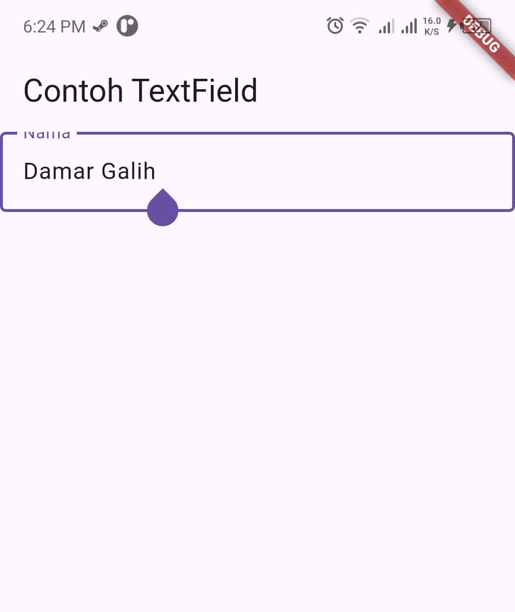
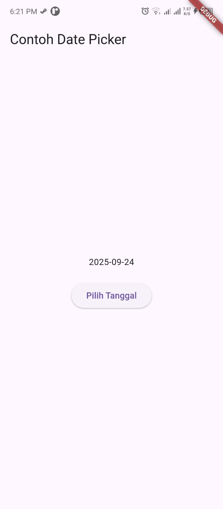
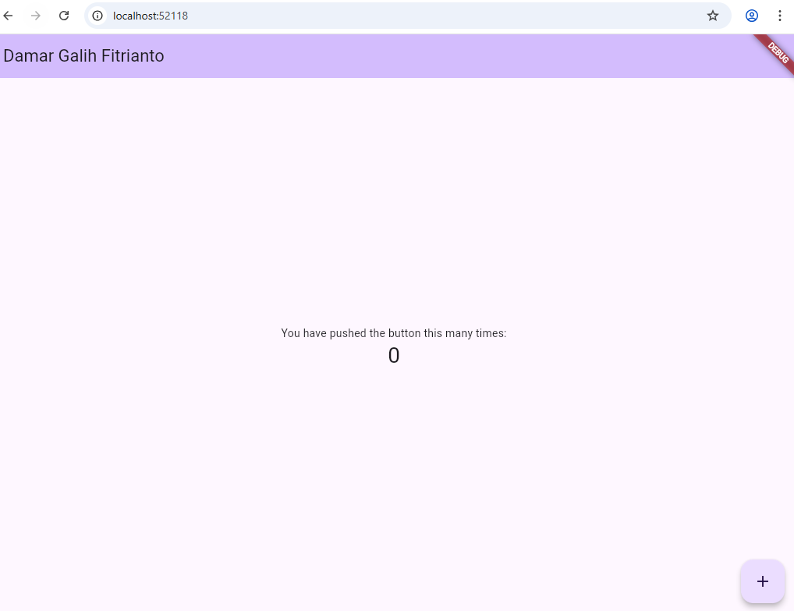
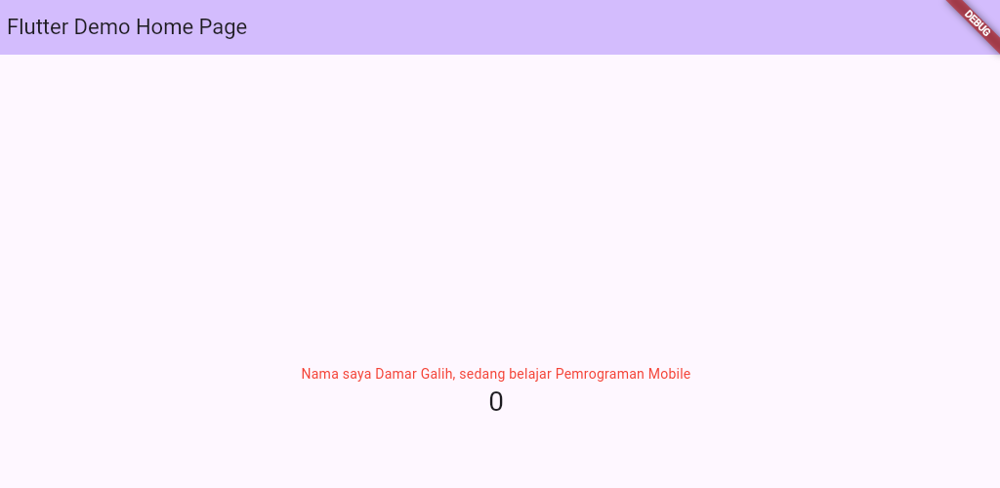
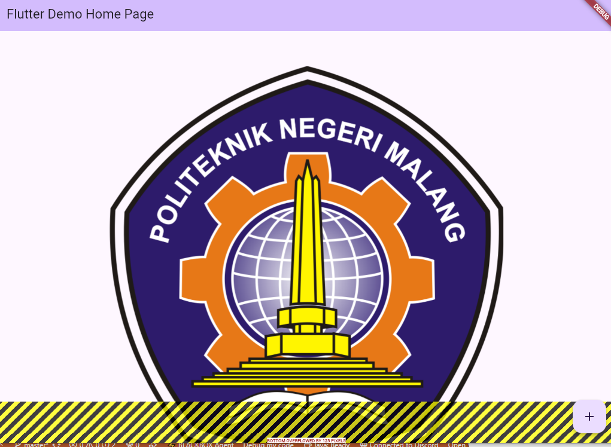
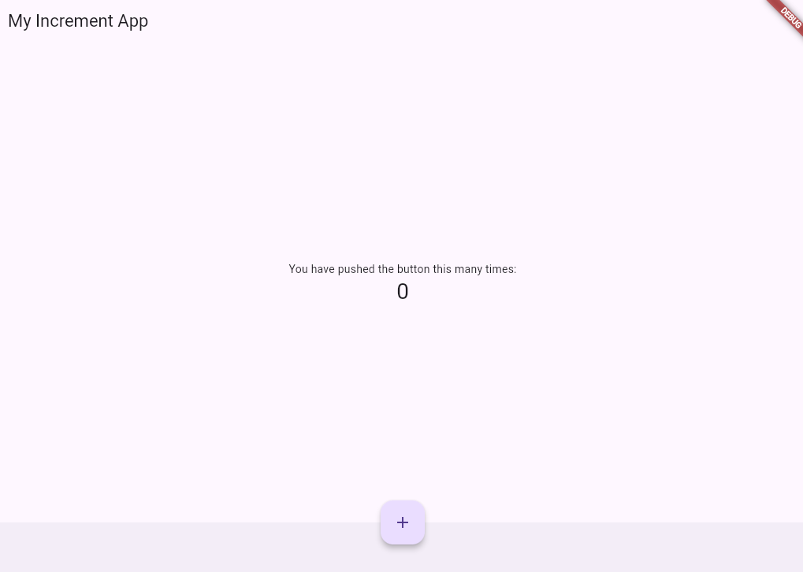
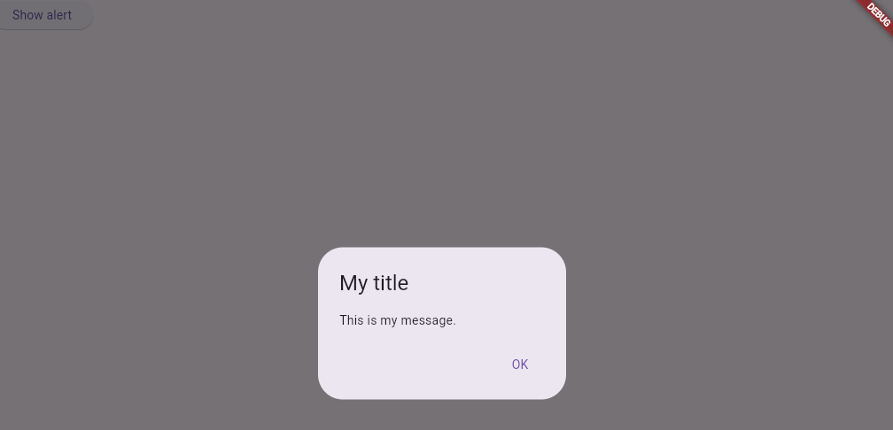
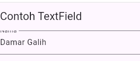
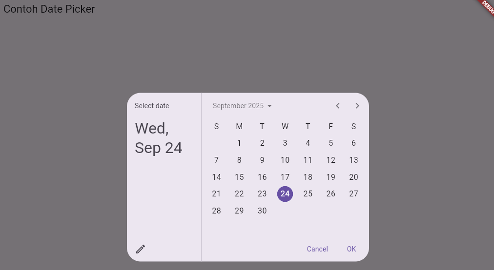

# Praktikum 5 Aplikasi Pertama dan Widget Dasar Flutter

Damar Galih Fitrianto
2341720200

Praktikum 2  Mobile

Praktikum 3 

Menampilkan nama .

Praktikum 4

menampilkan tulisan pada tengah web.

Menampilkan logo polinema.

Praktikum 5

Scaffold adalah widget utama dalam Flutter Material Design yang menyediakan struktur/layout dasar untuk sebuah halaman (screen).

showDialog adalah fungsi bawaan Flutter untuk menampilkan kotak dialog pop-up di layar.
Biasanya dipakai untuk:

Memberi informasi penting

Meminta konfirmasi (OK/Cancel)

Menampilkan error atau peringatan

Di dalam showDialog, kita biasanya pakai AlertDialog (untuk gaya Material) atau CupertinoAlertDialog (untuk gaya iOS).

Dalam Flutter, input selection merujuk pada pemilihan teks di dalam TextField atau TextFormField.
Contohnya:

Saat kita mengetik di TextField, lalu menyorot sebagian teks (highlight biru).

Saat kursor berkedip di posisi tertentu dalam teks.

Flutter mengatur ini dengan class TextSelection, dan properti terkait di TextEditingController.

DateTime adalah fungsi untuk menyimpan tanggal & waktu.